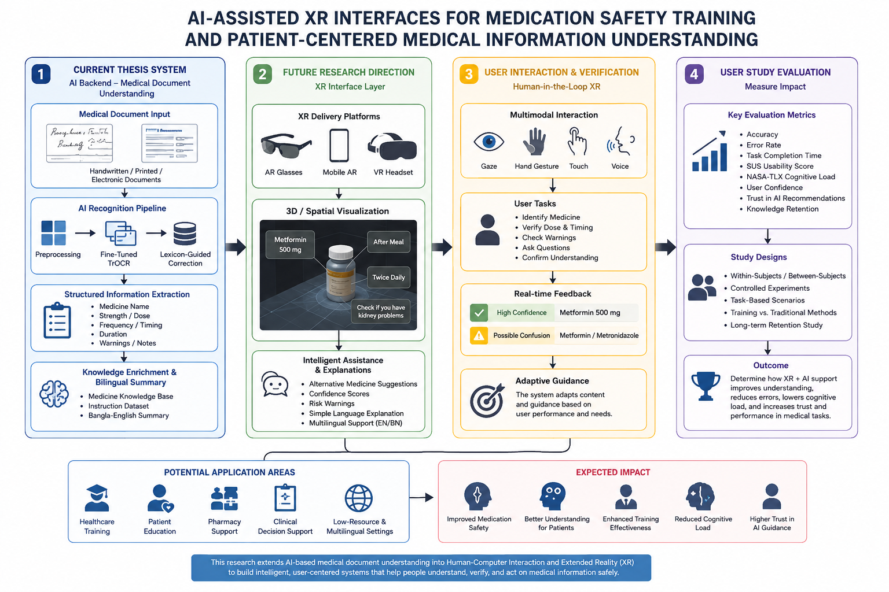

# Bilingual Handwritten Prescription Mining in Low-Resource Settings Using Fine-Tuned TrOCR

## Overview

This project presents an end-to-end AI pipeline for bilingual handwritten prescription understanding in low-resource healthcare settings such as Bangladesh. The system recognizes handwritten medicine names from prescription crops using a fine-tuned TrOCR model, corrects OCR errors using lexicon-guided Levenshtein post-processing, enriches medicine information using a structured medicine knowledge base, and generates patient-centric summaries in both English and Bangla.

## Motivation

Handwritten prescriptions in Bangladesh often contain mixed Bangla-English text, poor handwriting, irregular medicine spellings, and non-standard layouts. Misreading medicine names or dosage instructions can create serious patient-safety risks. This project aims to reduce ambiguity by combining OCR, domain-specific correction, and patient-friendly summarization.

## Key Results

| Method | CER ↓ | WER ↓ | Exact Match Accuracy ↑ |
|---|---:|---:|---:|
| Raw Fine-Tuned TrOCR | 8.86% | 27.96% | 73.13% |
| TrOCR + Lexicon-Guided Post-Processing | 5.87% | 13.42% | 88.06% |
| Absolute Improvement | 2.99% | 14.54% | 14.93% |

Lexicon-guided post-processing reduced CER by approximately 33.7%, reduced WER by approximately 52.0%, and improved exact medicine-name accuracy by 14.93 percentage points.

## Main Contributions

- Converted annotated prescription regions into OCR-ready medicine-name crops.
- Fine-tuned `microsoft/trocr-base-handwritten` for handwritten medicine-name recognition.
- Compared OCR approaches including TrOCR, DocTR, EasyOCR, and Tesseract.
- Designed lexicon-guided post-processing using Levenshtein edit distance.
- Built a medicine knowledge enrichment pipeline for strength, disease class, indication, frequency, and timing.
- Generated bilingual Bangla-English patient-centric prescription summaries.

## Future Research Direction: AI-Assisted XR/HCI Extension

Although this thesis focuses on AI-based prescription understanding, my future research goal is to move beyond backend OCR accuracy toward Human-Computer Interaction (HCI), 3D User Interfaces (3DUI), and Extended Reality (XR). The proposed future direction is to design and evaluate AI-assisted AR/VR interfaces that help people understand, verify, and safely act on medical information.

This direction is not limited to handwritten prescriptions. The current thesis provides the AI foundation for medical document understanding, while future XR/HCI research can extend it toward:

- medication-safety training for pharmacy and nursing students;
- AR-based explanation of printed, handwritten, or electronic medical instructions;
- human-in-the-loop verification of uncertain AI-recognized medicine information;
- gaze, hand gesture, touch, and voice-based multimodal interaction;
- patient-centered medical information understanding for low-literacy, bilingual, or multilingual users.

### Possible Research Questions

- How should XR systems present uncertain AI-recognized medical information so users can verify it accurately without increasing cognitive load?
- Can VR medication-safety training improve task accuracy, confidence, and knowledge retention compared with traditional screen-based or paper-based training?
- How do gaze-guided or hand-guided AR overlays affect user understanding of medication instructions, warnings, and timing information?
- How can multimodal XR feedback reduce errors in high-accuracy healthcare tasks while supporting users with different skill levels?

### Possible Evaluation Metrics

- Medicine identification accuracy
- Error correction rate
- Task completion time
- SUS usability score
- NASA-TLX cognitive load
- User confidence
- Trust in AI recommendations
- Knowledge retention after training

This future direction aligns with HCI/XR research because it focuses not only on AI recognition, but also on how humans interact with, understand, verify, and trust AI-supported medical information.

## Privacy and Ethical Note

This repository does not include identifiable patient data. Any prescription images used for demonstration are cropped, anonymized, blurred, or recreated for research presentation purposes.

## Technologies

- Python
- PyTorch
- Hugging Face Transformers
- TrOCR
- PIL / OpenCV
- pandas / NumPy
- Levenshtein distance
- OCR evaluation using CER and WER

## Author

Rakib Mohammad Ammar  
BSc in Computer Science and Engineering  
Port City International University, Bangladesh  

Research interests: AI, OCR, HCI, XR, low-resource healthcare, document understanding
